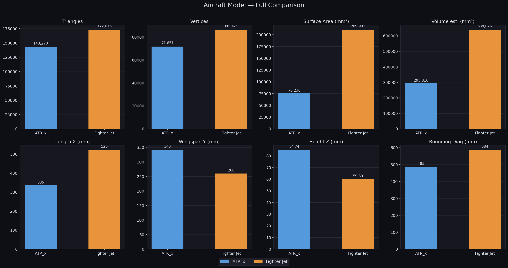
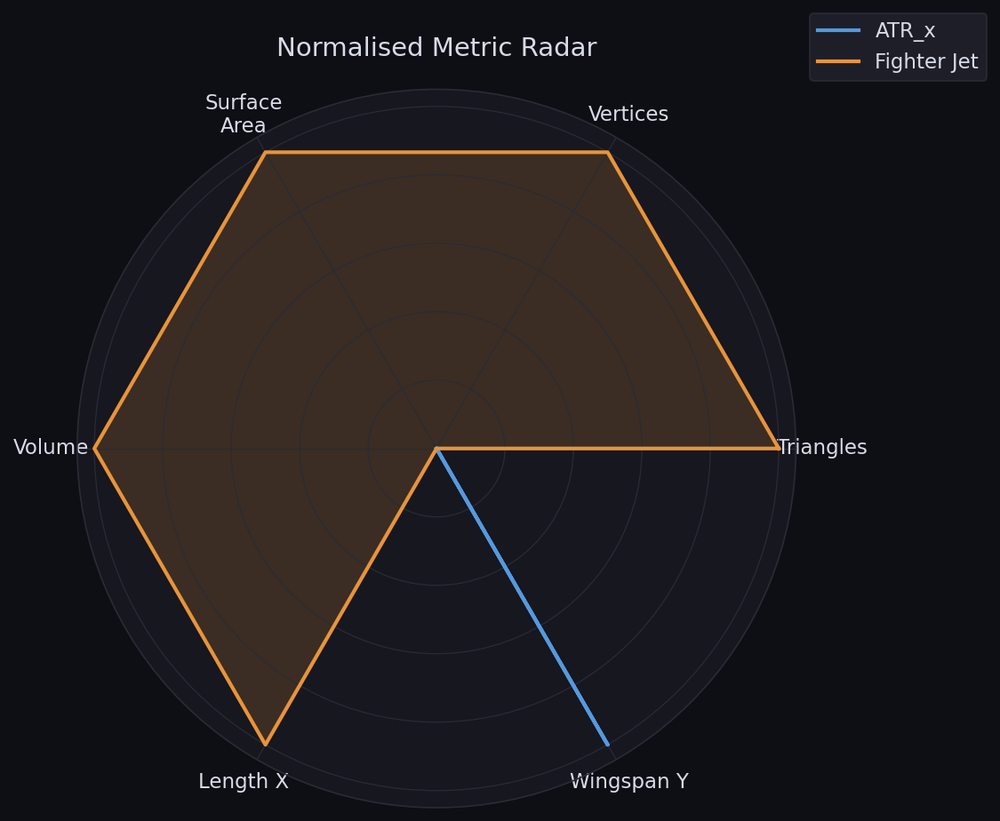
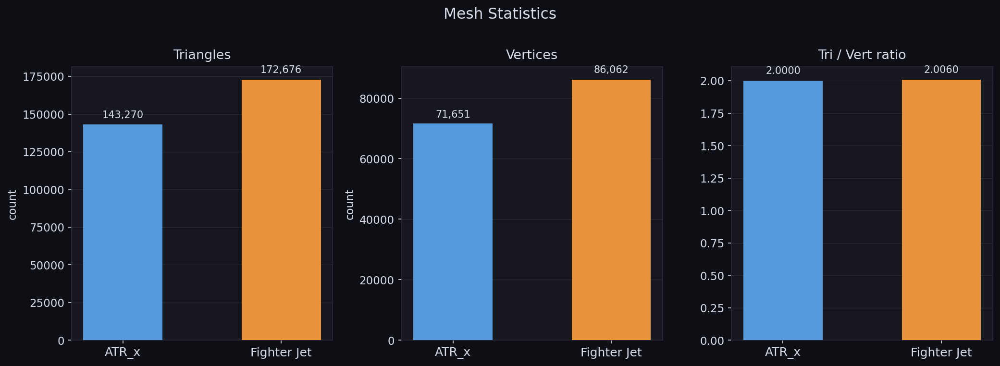
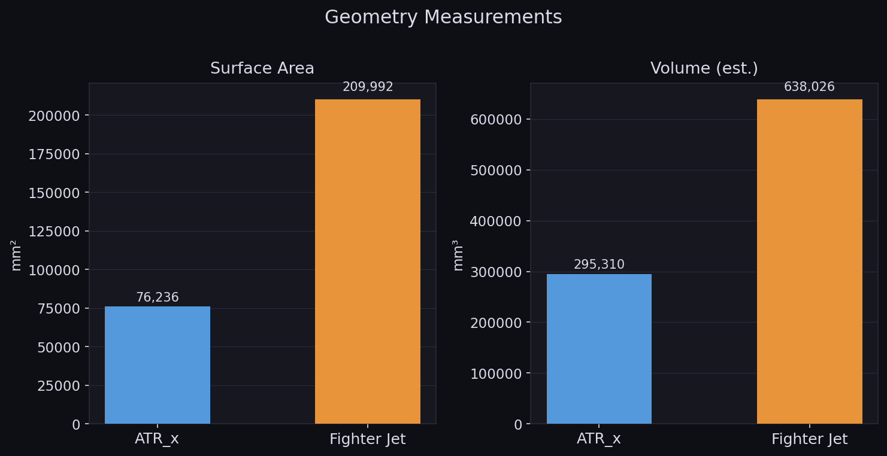
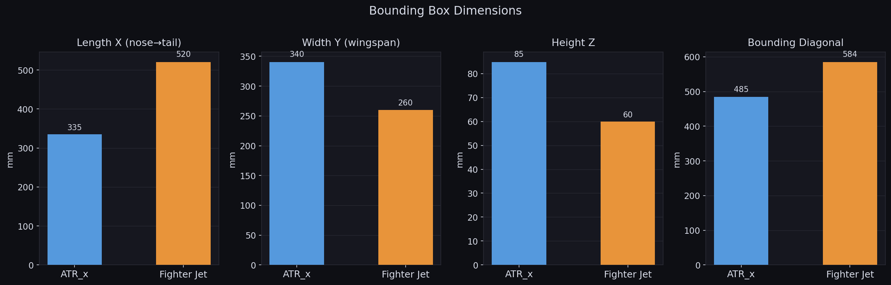
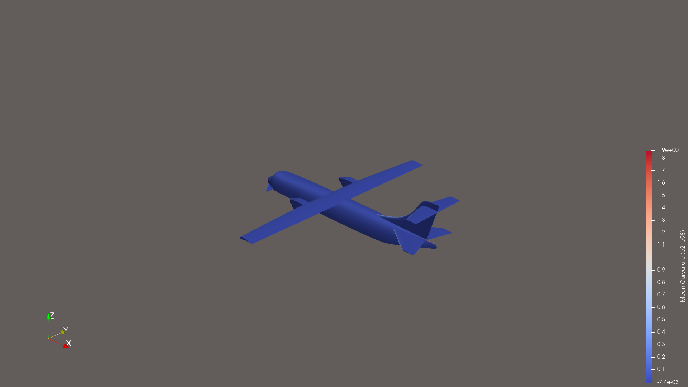
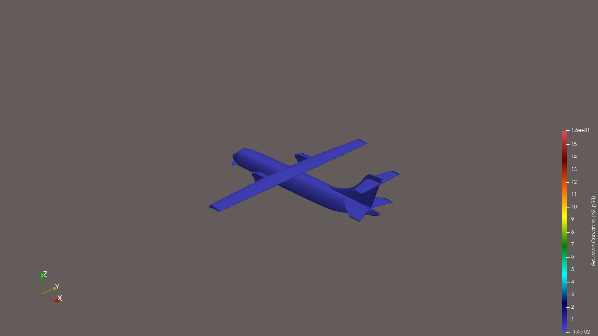
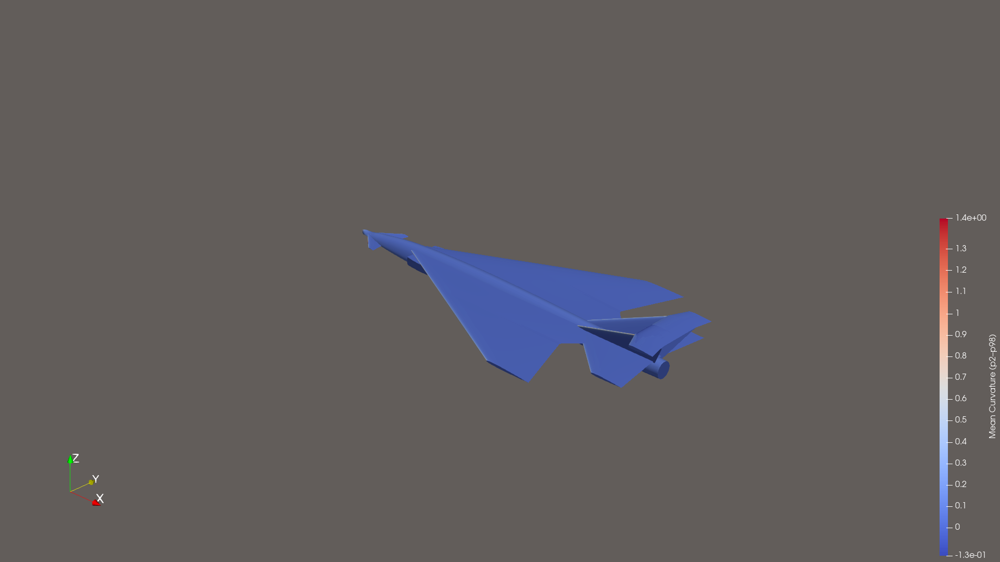
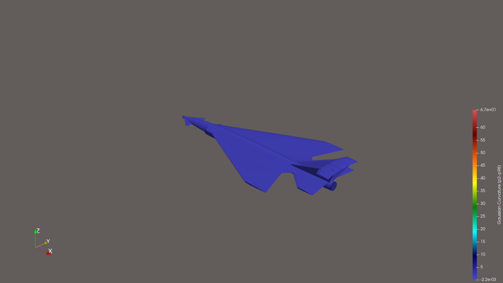

# Aircraft ParaView Analysis

Geometric and visual analysis of two aircraft STL models using [ParaView 6](https://www.paraview.org/).
Each model produces **20 renders**: 7 orthographic views, perspective, mean curvature, Gaussian curvature, and wireframe — all at 1920×1080.
Metric comparison charts are generated with matplotlib.

> **Curvature note:** color ranges are clipped to the **2nd–98th percentile** to suppress edge outliers
> and reveal actual surface variation. Raw ranges contain extreme spikes (e.g., ATR_x mean curvature
> spans −2.9 to +52.9; the p2–p98 window is −0.007 to +1.86).

---

## Models

| # | Model | File | Source |
|---|-------|------|--------|
| 1 | **ATR_x** | `ATR_x.stl` | [Thingiverse #7049570](https://www.thingiverse.com/thing:7049570) |
| 2 | **Fighter Jet Concept** | `Fighter_jet_concept.stl` | [Thingiverse #6930754](https://www.thingiverse.com/thing:6930754) |

---

## Comparison Summary

| Metric | ATR_x | Fighter Jet |
|--------|-------|-------------|
| **Triangles** | 143,270 | 172,676 |
| **Vertices** | 71,651 | 86,062 |
| **Tri/Vert ratio** | 2.000 | 2.006 |
| **Surface Area (units²)** | 76,235.70 | 209,992.46 |
| **Volume est. (units³)** | 295,310.39 | 638,026.24 |
| **Length X** | 335.15 | 520.00 |
| **Length Y (wingspan)** | 340.00 | 260.00 |
| **Height Z** | 84.74 | 59.89 |
| **Bounding diagonal** | 484.88 | 584.45 |
| **Mean curvature p2–p98** | −0.007 → 1.861 | −0.132 → 1.442 |
| **Gaussian curvature p2–p98** | −0.014 → 16.12 | −0.002 → 66.88 |

> Units are in the STL's native coordinate system (millimeters for these models).
> Volume is estimated from the closed surface via `vtkMassProperties`.

---

## Metric Comparisons

### Full Overview (all 8 metrics)


### Radar Chart (normalised across models)


### Mesh Statistics


### Geometry


### Bounding Box Dimensions


---

## ATR_x — ATR Turboprop Regional Aircraft Concept

### Perspective


### Front


### Rear


### Left Side


### Right Side


### Top


### Bottom


### Mean Curvature (p2–p98 clipped, Cool-to-Warm)


> **Blue** = concave (valleys, inlets), **Red** = convex (leading edges, nose, engine nacelles).
> Range clipped to p2–p98 (−0.007, 1.861) to suppress sharp-edge outliers.

### Gaussian Curvature (p2–p98 clipped, Rainbow Desaturated)


> Gaussian curvature = product of principal curvatures. Zero on flat/developable surfaces,
> positive on dome-like regions (nose), negative on saddle regions.

### Wireframe


---

## Fighter Jet Concept

### Perspective


### Front


### Rear


### Left Side


### Right Side


### Top


### Bottom


### Mean Curvature (p2–p98 clipped, Cool-to-Warm)


> Range clipped to p2–p98 (−0.132, 1.442).

### Gaussian Curvature (p2–p98 clipped, Rainbow Desaturated)


### Wireframe


---

## Repository Structure

```
aircraft-paraview-analysis/
├── models/
│   ├── ATR_x.stl
│   └── Fighter_jet_concept.stl
├── scripts/
│   ├── analyze.py          # ParaView 6 render + geometry analysis
│   └── compare.py          # Matplotlib comparison charts
├── results/
│   ├── analysis_results.json
│   ├── charts/             # 5 comparison charts
│   └── screenshots/        # 20 PNG renders per run (1920×1080)
└── README.md
```

## Reproducing the Analysis

Requirements: ParaView 6 with Python bindings (`pvpython`) and matplotlib.

```bash
# Renders + geometry analysis
pvpython --force-offscreen-rendering scripts/analyze.py

# Comparison charts (uses results/analysis_results.json)
python scripts/compare.py
```

Full numeric results (bounding box, surface area, volume, curvature percentile ranges) are in
[`results/analysis_results.json`](results/analysis_results.json).

---

*Done with [ParaView](https://www.paraview.org/) 6.0.1.*
