# Aircraft ParaView Analysis

Geometric and visual analysis of two aircraft STL models using [ParaView 6](https://www.paraview.org/).
Each model is analyzed for mesh statistics, bounding-box geometry, surface area, estimated volume, and rendered from 9 viewpoints (7 orthographic + curvature heat-map + wireframe).

---

## Models

| # | Model | File | Source |
|---|-------|------|--------|
| 1 | **ATR_x** | `ATR_x.stl` | [Thingiverse #7049570](https://www.thingiverse.com/thing:7049570) |
| 2 | **Fighter Jet Concept** | `Fighter_jet_concept.stl` | [Thingiverse #6930754](https://www.thingiverse.com/thing:6930754) |

---

## Comparison Summary

| Metric | ATR_x | Fighter Jet |
|--------|-------|-------------|
| **Triangles** | 143,270 | 172,676 |
| **Vertices** | 71,651 | 86,062 |
| **Tri/Vert ratio** | 2.000 | 2.006 |
| **Surface Area (units²)** | 76,235.70 | 209,992.46 |
| **Volume est. (units³)** | 295,310.39 | 638,026.24 |
| **Length X** | 335.15 | 520.00 |
| **Length Y (wingspan)** | 340.00 | 260.00 |
| **Height Z** | 84.74 | 59.89 |
| **Bounding diagonal** | 484.88 | 584.45 |

> Units are in the STL file's native coordinate system (millimeters for these models).
> Volume is estimated from the closed surface via `vtkMassProperties` — valid only for watertight meshes.

---

## ATR_x — ATR Turboprop Regional Aircraft Concept

### Perspective View
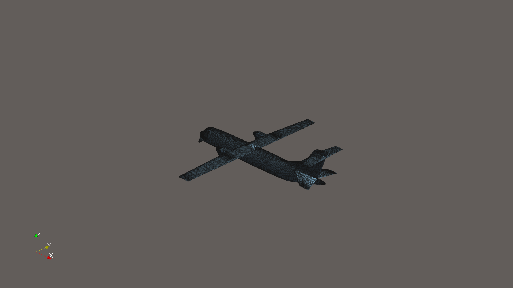

### Front
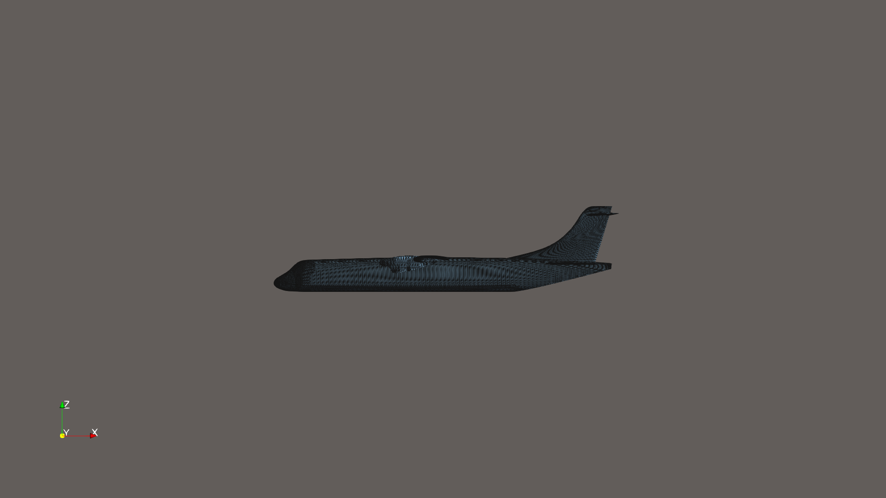

### Rear
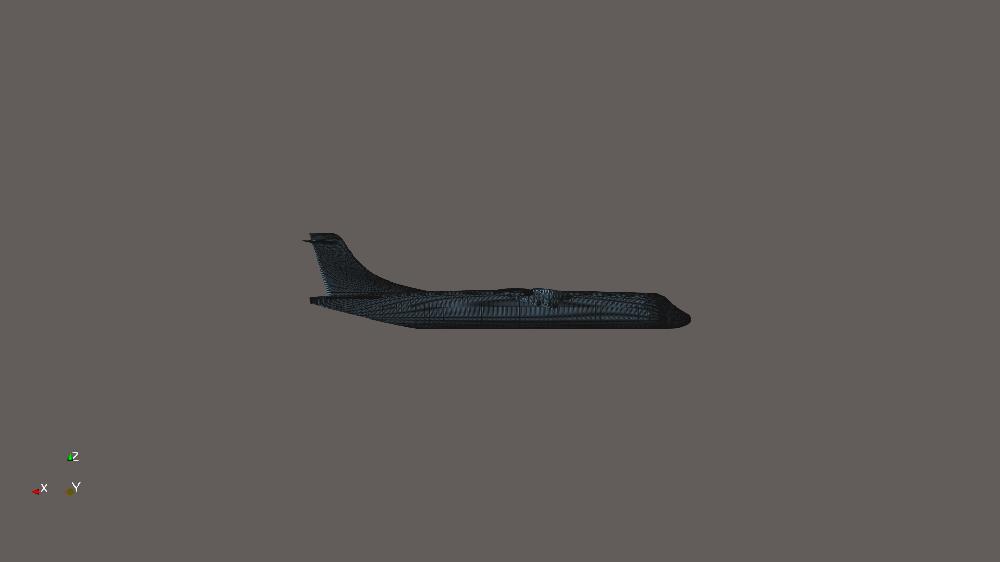

### Left Side
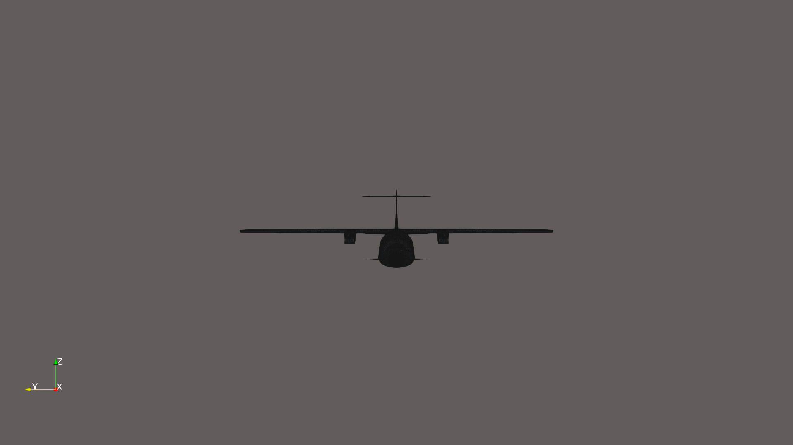

### Right Side
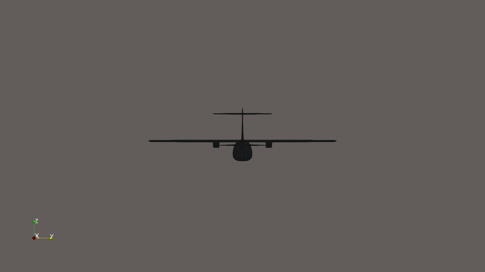

### Top
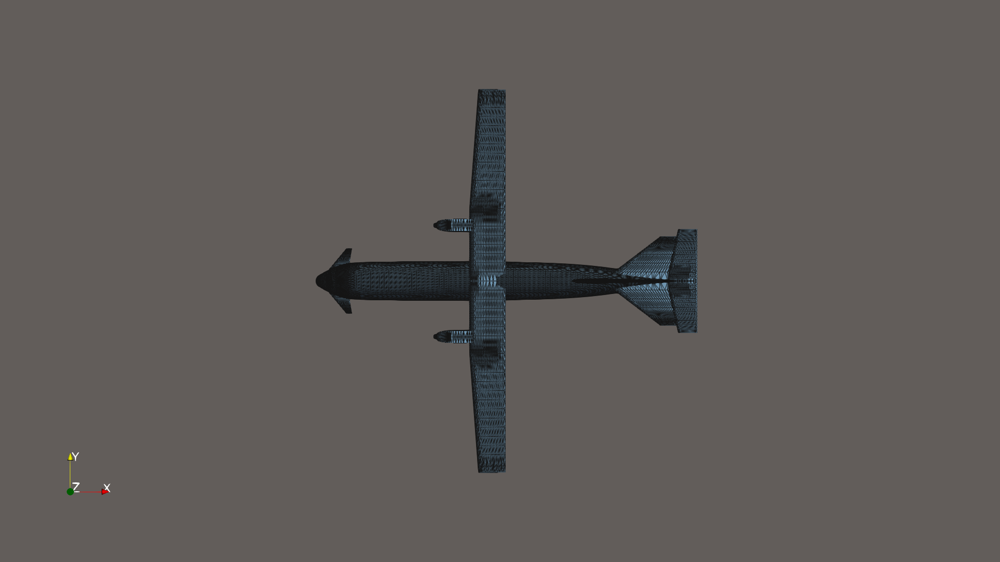

### Bottom
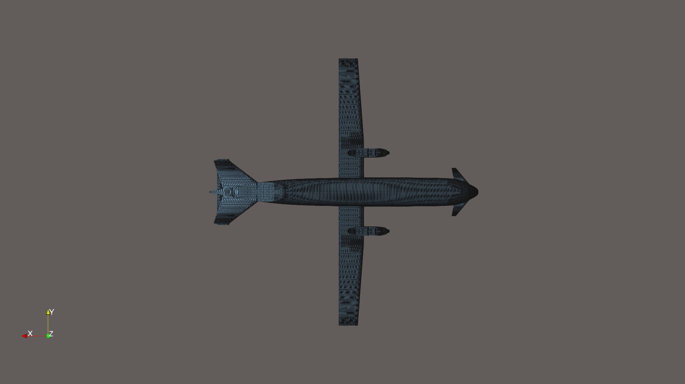

### Mean Curvature Heat-Map
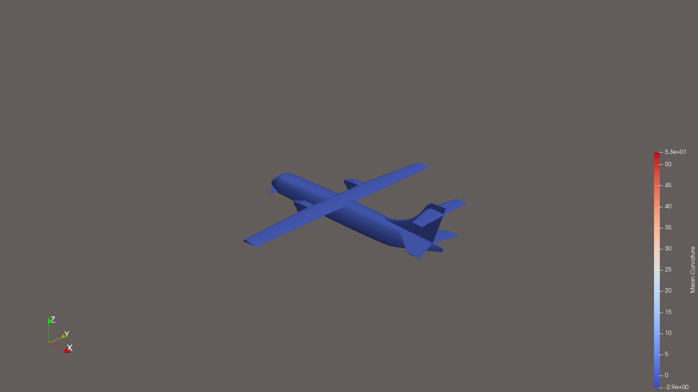

> Cool-to-Warm color map: **blue** = concave regions, **red** = convex regions.

### Wireframe


---

## Fighter Jet Concept

### Perspective View
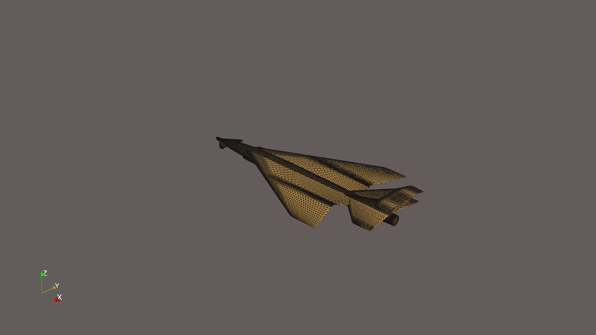

### Front
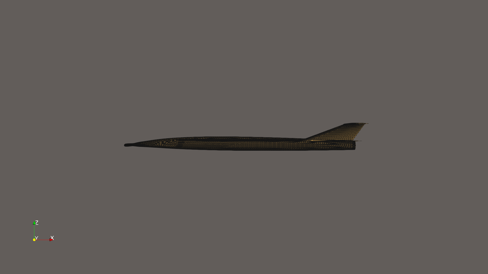

### Rear
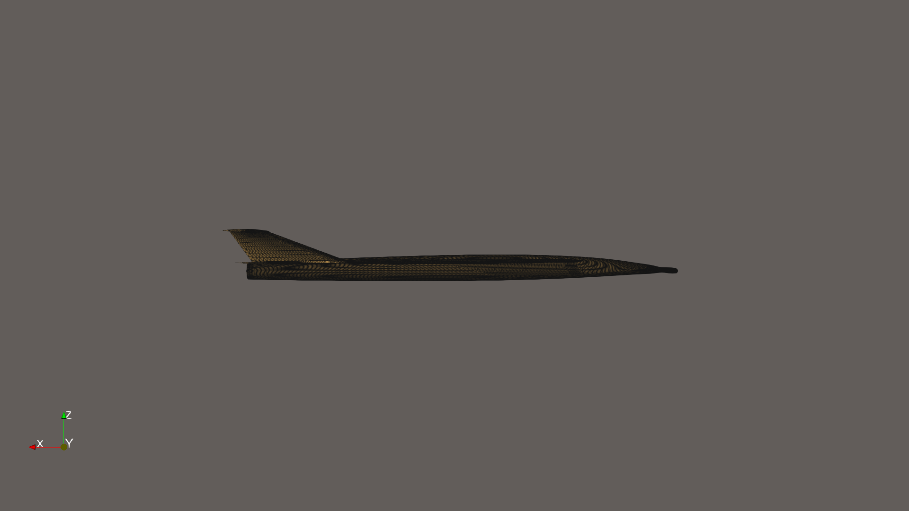

### Left Side
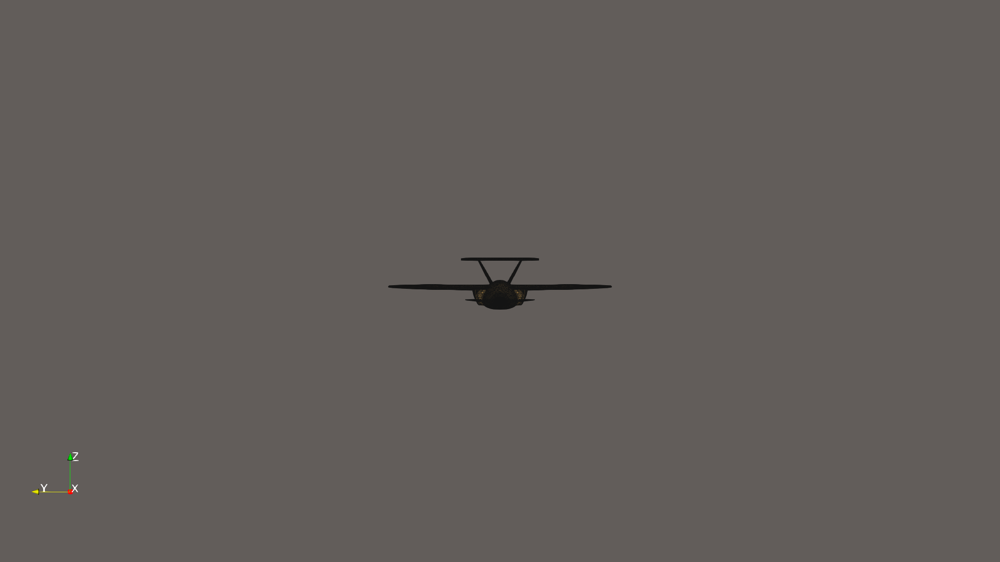

### Right Side
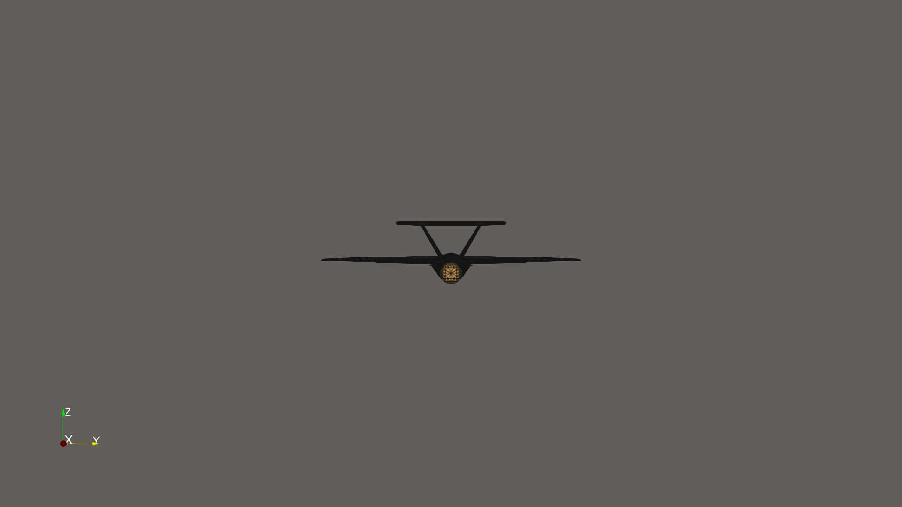

### Top
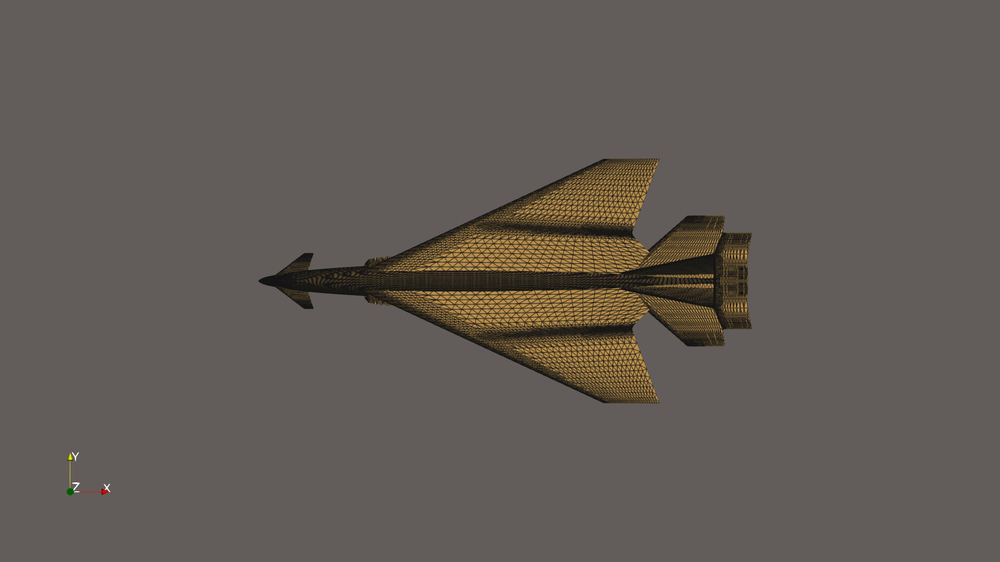

### Bottom
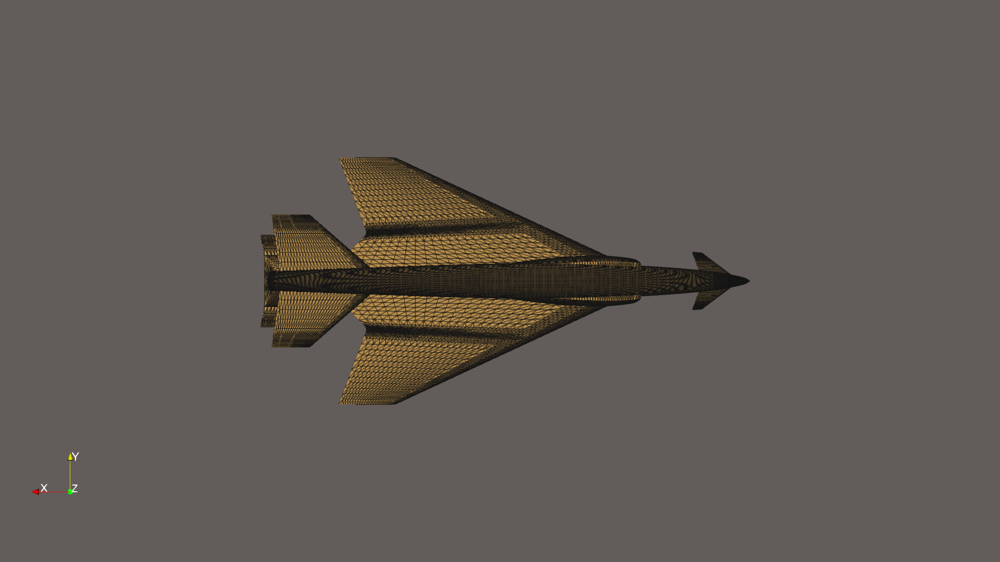

### Mean Curvature Heat-Map
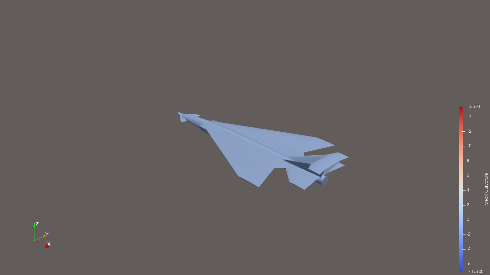

> Cool-to-Warm color map: **blue** = concave regions, **red** = convex regions.

### Wireframe
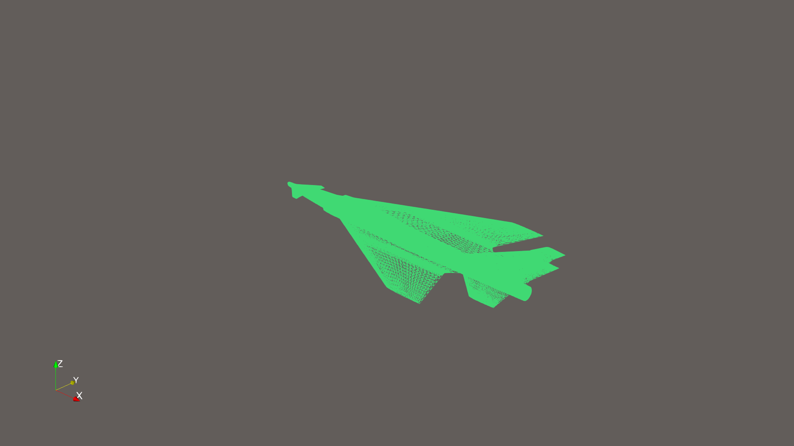

---

## Repository Structure

```
aircraft-paraview-analysis/
├── models/
│   ├── ATR_x.stl
│   └── Fighter_jet_concept.stl
├── scripts/
│   └── analyze.py          # ParaView 6 analysis script
├── results/
│   ├── analysis_results.json
│   └── screenshots/        # 18 PNG renders (1920×1080)
└── README.md
```

## Reproducing the Analysis

Requirements: ParaView 6 with Python bindings (`pvpython`).

```bash
pvpython --force-offscreen-rendering scripts/analyze.py
```

Full JSON results are in [`results/analysis_results.json`](results/analysis_results.json).

---

*Generated with [ParaView](https://www.paraview.org/) 6.0.1 and [Claude Code](https://claude.ai/claude-code).*
